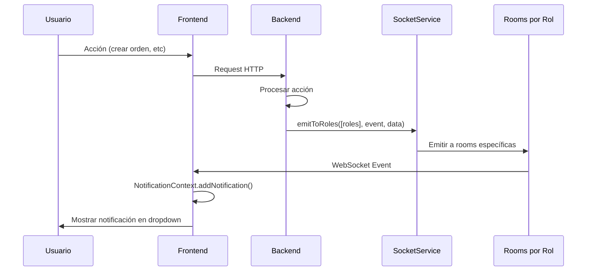

# Plan de Implementación: Sistema de Notificaciones en Tiempo Real

## Estado: ✅ IMPLEMENTADO

## Resumen Ejecutivo

Este documento describe la implementación del sistema de notificaciones en tiempo real para mesaDigital, filtrando por roles en el backend y utilizando la UI existente de notificaciones en el navbar.

---

## 1. Estado Actual del Sistema

### Backend
- **SocketService** (`backend/src/socket/socket.service.ts`):
  - `emitToRoom(room, event, payload)` - Emite a una room específica
  - `emitToRoles(roles, event, payload)` - Emite a múltiples rooms de roles
  - `emitToUser(userId, event, payload)` - Emite a usuario específico

- **SocketGateway** (`backend/src/socket/socket.gateway.ts`):
  - Auto-join a rooms basados en handshake auth: `role:{role}`, `user:{userId}`, `location:{locationId}`

### Frontend
- **SocketContext** (`frontend/src/context/SocketContext.tsx`):
  - Conecta con auth desde localStorage (role, userId)
  - Métodos `joinRooms`, `leaveRooms`, `emit` están suprimidos (no-op)

- **NotificationContext** (`frontend/src/context/NotificationContext.tsx`):
  - Gestiona estado de notificaciones
  - Muestra dropdown en el header
  - No escucha eventos del socket directamente

- **NotificationDropdown** (`frontend/src/components/header/NotificationDropdown.tsx`):
  - UI existente que muestra notificaciones con badge de no leídas

---

## 2. Arquitectura Propuesta

### Diagrama de Flujo



### Rooms por Rol

| Room | Descripción | Miembros |
|------|-------------|----------|
| `role:ADMIN` | Administradores | Todos los admin |
| `role:SUPERVISOR` | Supervisores | Todos los supervisors |
| `role:WAITER` | Meseros | Todos los waiters |
| `role:KITCHEN` | Cocina | Todo el personal de cocina |
| `role:CASHIER` | Cajeros | Todos los cashiers |
| `user:{id}` | Usuario específico | Un solo usuario |
| `location:{id}` | Por ubicación | Usuarios en esa location |

---

## 3. Eventos de Socket

### Eventos del Servidor al Cliente

```typescript
interface ServerEvents {
  // Notificación genérica
  'notification': {
    type: 'info' | 'success' | 'warning' | 'error' | 'order';
    title: string;
    message?: string;
    data?: unknown;
    createdAt: number;
  };
  
  // Eventos específicos de órdenes
  'order:created': { order: Order; notification: Notification };
  'order:updated': { orderId: string; oldStatus: string; newStatus: string; notification: Notification };
  'order:cancelled': { orderId: string; reason?: string; notification: Notification };
  
  // Eventos de items de orden
  'item:statusChanged': { 
    itemId: string; 
    orderId: string; 
    oldStatus: string; 
    newStatus: string;
    assignedTo?: string;
    notification: Notification;
  };
  
  // Eventos de mesas
  'table:statusChanged': { 
    tableId: string; 
    oldStatus: string; 
    newStatus: string;
    currentOrderId?: string | null;
  };
}
```

---

## 4. Matriz de Notificaciones por Evento y Rol

| Evento | ADMIN | SUPERVISOR | WAITER | KITCHEN | CASHIER |
|--------|-------|------------|--------|---------|---------|
| `order:created` | ✅ | ✅ | ✅ | ✅ | ❌ |
| `order:statusChanged → PREPARING` | ❌ | ✅ | ✅ | ✅ | ❌ |
| `order:statusChanged → READY` | ❌ | ❌ | ✅ | ❌ | ✅ |
| `order:statusChanged → SERVED` | ❌ | ✅ | ✅ | ❌ | ❌ |
| `order:statusChanged → AWAITING_PAYMENT` | ❌ | ✅ | ✅ | ❌ | ✅ |
| `order:statusChanged → PAID` | ✅ | ✅ | ❌ | ❌ | ✅ |
| `order:cancelled` | ✅ | ✅ | ✅ | ❌ | ❌ |
| `item:statusChanged → PREPARING` | ❌ | ✅ | ✅ | ✅ | ❌ |
| `item:statusChanged → READY` | ❌ | ❌ | ✅ | ❌ | ✅ |
| `item:statusChanged → CANCELLED` | ✅ | ✅ | ❌ | ❌ | ❌ |
| `table:occupied` | ❌ | ✅ | ✅ | ❌ | ❌ |
| `table:available` | ❌ | ✅ | ✅ | ❌ | ❌ |

---

## 5. Implementación en Backend

### 5.1 Helper para Notificaciones

Crear método privado en `OrdersService`:

```typescript
private async notifyOrderEvent(
  event: 'order:created' | 'order:updated' | 'order:cancelled' | 'item:statusChanged',
  data: any,
  status?: string
) {
  const roles = status 
    ? this.rolesForOrderStatus(status) 
    : this.rolesForItemStatus(data.newStatus);
  
  const notification: Partial<Notification> = {
    type: 'order',
    title: this.getNotificationTitle(event, data),
    message: this.getNotificationMessage(event, data),
    data,
    createdAt: Date.now(),
  };
  
  this.socketService.emitToRoles(roles, event, { ...data, notification });
  this.socketService.emitToRoles(roles, 'notification', notification);
}
```

### 5.2 Puntos de Integración en OrdersService

| Método | Línea Aproximada | Acción |
|--------|------------------|--------|
| `create()` | ~207 | Después de crear orden exitosamente |
| `update()` | ~486 | Después de actualizar status de orden |
| `updateItem()` | ~554 | Después de cambiar status de item |
| `deleteItem()` | ~593 | Después de eliminar item |
| `cancelOrder()` | ~622 | Después de cancelar orden |

### 5.3 Ejemplo de Implementación en `create()`

```typescript
// Después de session.commitTransaction() o return created;
await this.notifyOrderEvent('order:created', {
  orderId: String(created._id),
  orderNumber: created.orderNumber,
  tableId: created.tableId ? String(created.tableId) : null,
  tableLabel: created.tableLabel,
  total: created.total,
  peopleCount: created.people?.length || 0,
}, created.status);
```

### 5.4 Ejemplo de Implementación en `updateItem()`

```typescript
// Después de await doc.save();
await this.notifyOrderEvent('item:statusChanged', {
  itemId,
  orderId: String(doc._id),
  orderNumber: doc.orderNumber,
  oldStatus: oldItemStatus,
  newStatus: dto.status,
  itemName: itemSnapshot?.name,
  assignedTo: dto.assignedTo,
}, dto.status);
```

---

## 6. Implementación en Frontend

### 6.1 Actualizar SocketContext para Escuchar Eventos

```typescript
useEffect(() => {
  // ... existing connection code ...
  
  // Escuchar eventos de notificaciones
  const handleNotification = (payload: any) => {
    addNotification(payload);
  };
  
  const handleOrderCreated = (payload: any) => {
    // El payload ya incluye la notificación
    if (payload.notification) {
      addNotification(payload.notification);
    }
  };
  
  const handleItemStatusChanged = (payload: any) => {
    if (payload.notification) {
      addNotification(payload.notification);
    }
  };
  
  s.on('notification', handleNotification);
  s.on('order:created', handleOrderCreated);
  s.on('order:updated', handleOrderCreated);
  s.on('item:statusChanged', handleItemStatusChanged);
  
  return () => {
    s.off('notification', handleNotification);
    s.off('order:created', handleOrderCreated);
    s.off('item:statusChanged', handleItemStatusChanged);
    // ... existing cleanup ...
  };
}, [addNotification]);
```

### 6.2 KDS - Solo Actualización Automática

El KDS ya usa `findForKDS()` que filtra órdenes con items no-ready. Las actualizaciones automáticas se manejarán mediante:

1. Polling existente (si lo hay)
2. O evento `order:updated` que refresca la vista

No se muestran notificaciones toast en KDS para cambios de status de items.

---

## 7. Tareas de Implementación

### Backend

- [ ] Agregar método `notifyOrderEvent()` en [`OrdersService`](backend/src/orders/orders.service.ts:53)
- [ ] Integrar notificación en [`create()`](backend/src/orders/orders.service.ts:104) después de crear orden
- [ ] Integrar notificación en [`update()`](backend/src/orders/orders.service.ts:333) al cambiar status
- [ ] Integrar notificación en [`updateItem()`](backend/src/orders/orders.service.ts:490) al cambiar status de item
- [ ] Integrar notificación en [`cancelOrder()`](backend/src/orders/orders.service.ts:598)
- [ ] Crear `TablesService.notifyTableStatusChange()` si no existe
- [ ] Agregar interfaz `Notification` en archivo compartido

### Frontend

- [ ] Actualizar [`SocketContext`](frontend/src/context/SocketContext.tsx:16) para escuchar eventos
- [ ] Conectar listeners con [`NotificationContext`](frontend/src/context/NotificationContext.tsx:32)
- [ ] Configurar exclusión de notificaciones para KDS
- [ ] Validar que [`NotificationDropdown`](frontend/src/components/header/NotificationDropdown.tsx:6) muestre correctamente

---

## 8. Consideraciones de Seguridad

1. **Autenticación JWT en Socket**: Actualmente el handshake usa datos del localStorage sin validar. Se recomienda:
   - Enviar token JWT en `auth.token` durante handshake
   - Validar token en `handleConnection()` del Gateway
   - Extraer role y userId del token validado

2. **Autorización de Eventos**: Verificar que el usuario solo reciba eventos de su location (si aplica multi-location)

---

## 9. Testing

### Pruebas a Realizar

1. **Crear orden como mesero** → Cocina y supervisor reciben notificación
2. **Cambiar status de item a PREPARING desde KDS** → Mesero y supervisor reciben notificación
3. **Cambiar status de item a READY desde KDS** → Mesero y cajero reciben notificación
4. **Marcar orden como PAGADA desde Caja** → Admin y supervisor reciben notificación
5. **Cancelar orden** → Admin, supervisor y mesero reciben notificación
6. **KDS recibe actualizaciones** pero NO notificaciones toast

---

## 10. Timeline Estimado

| Fase | Tareas | Duración Relativa |
|------|--------|-------------------|
| 1. Backend - Core | Helpers + integrate en create/update | 2 unidades |
| 2. Backend - Items | updateItem + cancelOrder | 1 unidad |
| 3. Frontend - Listeners | SocketContext + NotificationContext | 1 unidad |
| 4. KDS - Exclusiones | Configurar filtros | 0.5 unidades |
| 5. Testing | Pruebas end-to-end | 0.5 unidades |

---

## 11. Archivos a Modificar

### Backend
- [`backend/src/orders/orders.service.ts`](backend/src/orders/orders.service.ts)
- [`backend/src/socket/socket.service.ts`](backend/src/socket/socket.service.ts) (posibles mejoras)
- `backend/src/common/interfaces/notification.interface.ts` (nuevo archivo)

### Frontend
- [`frontend/src/context/SocketContext.tsx`](frontend/src/context/SocketContext.tsx)
- [`frontend/src/context/NotificationContext.tsx`](frontend/src/context/NotificationContext.tsx)
- `frontend/src/pages/KDS/` (configurar exclusiones si es necesario)
